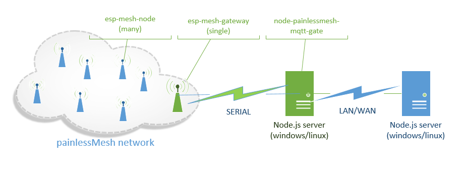

# MQTT gateway for painlessMesh network



Gateway node in mesh network connects to mqtt gateway via serial connection.

## Message relay
Messages shall be in JSON format. Only *topic* and *payload* are used. Payload is left intact. Topic being changed when relaying.
```
{ "topic": "....", "payload":"........." }
```
### Mesh ==> MQTT
All messages inside mesh network which sent to esp-mesh-gateway will be relayed to MQTT broker.

| topic in mesh | published to MQTT topic   | comment |
| --------------| -------------------- | ------- |
|      abc      |   mesh-out/XXXX/abc  | where XXXX is mesh.nodeId() |


### MQTT ==> Mesh
Only MQTT messages sent to "mesh_in/XXXX/blahblah" topics are being relayed to mesh.

| topic in MQTT | relayed to mesh as | comment |
| --------------| -------------------- | ------- |
| mesh-out/XXXX/abc | abc  | direct message to node with mesh.nodeId()=XXXX |
| mesh-out/0/abc | abc  | broadcast message to all nodes in mesh |

## Components
### esp-mesh-node 
These are regular nodes in mesh. Use as a base for esp8266/esp32 devices.
### esp-mesh-gateway
This is gateway node in mesh. Only one. Shall be connected to server machine via serial.
### node-painlessmesh-mqtt-gate
This is node.js based gateway which listens to messages from serial port, relays them to MQTT and back. Can be run on any windows or linux machine which supports node.js.
#### build procedure 
1. -- at first install node.js and npm (i tried on node 8.x, npm 5.x)
2. cd node-painlessmesh-mqtt-gate
3. edit config.js or export env variables (look inside file)
3. npm install
4. npm start


